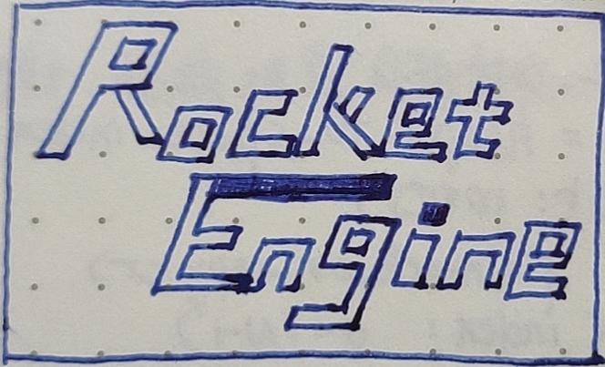

# RocketEngine

[article 00 绪论-写作原因与后续计划](Document/article_00/article_00.md) 
[article 01 第一个简单项目](Document/article_01/article_01.md) 
[article 02 接入内存检测功能](Document/article_02/article_02.md) 
[article 03 第一个窗口-GLFW](Document/article_03/article_03.md) 
[article 04 日志输出](Document/article_04/article_04.md) 
[article 05 算法分支-算法初步](Document/article_05/article_05.md) 
[article 06 设计模式分支-1](Document/article_06/article_06.md) 
[article 07 引入模块划分](Document/article_07/article_07.md) 
[article 08 文件系统](Document/article_08/article_08.md) 
[article 09 事件系统](Document/article_09/article_09.md) 
[article 10 算法分支-基础算法](Document/article_10/article_10.md) 
[article 11 TCP/IP](Document/article_11/article_11.md) 
[article 12 引擎配置文件(YAML)](Document/article_12/article_12.md) 
[article 13 音频系统](Document/article_13/article_13.md) 
[article 14 JSON文件解析](Document/article_14/article_14.md) 
[article 15 渲染分支-GAMES101课程笔记-1 开始渲染吧！](Document/article_15/article_15.md) 
[article 16 物理引擎](Document/article_16/article_16.md) 
[article 17 OBJ Parser](Document/article_17/article_17.md) 
[article 18 渲染分支-GAMES101课程笔记-2](Document/article_18/article_18.md) 
[article 19 渲染分支-GAMES101课程笔记-3](Document/article_19/article_19.md) 
